# Bulk RNA-Seq Analysis

🎯 Project Overview:

This repository demonstrates a complete bulk RNA-Seq workflow analyzing how human cartilage cells (chondrocytes) respond to cyproheptadine, a drug that shows promise for treating osteoarthritis. The analysis compares gene expression under four conditions (drug, inflammatory stimulus, combined treatment, and control) to identify drug effects, inflammatory responses, and any protective/reversal actions of cyproheptadine in inflamed chondrocytes.

The study examined the effects of:
- **Cyproheptadine** - a drug candidate that may help protect cartilage and slow down osteoarthritis
- **IL-1β** - an inflammatory molecule that damages cartilage (mimics what happens in osteoarthritis)
- **Combination treatment** - cyproheptadine given together with IL-1β to see if the drug can protect cells from inflammation

This dataset helps us compare how cyproheptadine works in healthy cells versus inflamed cells, giving us insights into how it might treat osteoarthritis by protecting the cartilage in our joints.

## 🧪 Sample Information

| Sample ID      | Treatment Condition | SRA Accessions |
|----------------|---------------------|----------------|
| Sample 1 - 5   | Cyp + IL-1β         | SRR32684363 - SRR32684367 |
| Sample 6 - 10  | IL-1β               | SRR32684368 - SRR32684372 |
| Sample 11 - 15 | Cyproheptadine      | SRR32684373 - SRR32684377 |
| Sample 16 - 20 | DMSO (Control)      | SRR32684378 - SRR32684382 |

📂 Dataset Information:
- **GEO Accession:** [GSE291878](https://www.ncbi.nlm.nih.gov/geo/query/acc.cgi?acc=GSE291878)
- **Experiment Type:** Expression profiling by high-throughput sequencing
- **Description:** RNA-Seq experiment in human cartilage cells to see how cyproheptadine changes gene activity in normal conditions and during inflammation. Osteoarthritis is a common joint disease with no cure, and this study helps identify cyproheptadine as a potential treatment option.
- **Citations:**
  1. Kurakazu I, Olmer M, Swahn H, Myers K et al. (2025) Histamine H1 receptor inverse agonists improve structure and pain in an osteoarthritis mouse model. J Clin Invest 135(21). [PMID: 40875519]

## Quick Navigation

- [1. Downloading necessary tools and make directories](#1-downloading-necessary-tools-and-make-directories)
- [2. Fetching SRA Files](#2-fetching-sra-files)
- [3. FastQC - Quality Control](#3-fastqc---quality-control)
- [4. MultiQC](#4-multiqc)
- [5. Trimming Reads (optional)](#5-trimming-reads-optional)
- [6. Post-trimming Quality Control](#6-post-trimming-quality-control)
- [7. Reference Genome Preparation (Indexing)](#7-reference-genome-preparation-indexing)
- [8. Alignment/Mapping](#8-alignmentmapping)
- [9. BAM index file](#9-bam-index-file)
- [10. Assessing Alignment Quality](#10-assessing-alignment-quality)
- [11. Convert GTF to BED](#11-convert-gtf-to-bed)
- [12. Determine Library Strandedness](#12-determine-library-strandedness)
- [13. Feature Counting (Read Quantification)](#13-feature-counting-read-quantification)
- [14. Downstream analysis (R / Bioconductor)](#14-downstream-analysis-r--bioconductor)
  - [14.1 Setup and data import](#141-setup-and-data-import)
  - [14.2 Experimental design and DESeq2 setup](#142-experimental-design-and-deseq2-setup)
  - [14.3 Differential gene expression analysis](#143-differential-gene-expression-analysis)
  - [14.4 Quality control and exploratory analysis](#144-quality-control-and-exploratory-analysis)
  - [14.5 Visualization of differential expression results](#145-visualization-of-differential-expression-results)
  - [14.6 Gene set enrichment analysis (GSEA)](#146-gene-set-enrichment-analysis-gsea)
  - [14.7 Key outputs generated](#147-key-outputs-generated)
  - [14.8 Biological interpretation](#148-biological-interpretation)

---

## Workflow

This section documents the practical steps used to process raw SRA data through alignment, quantification, differential expression, and pathway analysis. Commands show example usage and can be adapted (threads, file names) to your compute environment.

---

## 1. Downloading necessary tools and make directories
- Download all the necessary tools and make directories.

```bash

conda install -y -c bioconda -c conda-forge fastqc multiqc sra-tools hisat2 samtools trimmomatic subread qualimap rseqc bedops

mkdir -p SRA_files FASTQ_files FASTQC_reports Multiqc_reports reference aligned_reads quants rnaseq_qc_results 

```
---

## 2. Fetching SRA Files
- Download SRA files using the SRA toolkit.
- Convert the SRA files into FASTQ files using fastq-dump.
- Save the file in .gz format i.e. gzip file so that it would take less space.

```bash
#Download SRA files
prefetch SRR32684363 SRR32684364 SRR32684365 SRR32684366
SRR32684367 SRR32684368 SRR32684369 SRR32684370 SRR32684371
SRR32684372 SRR32684373 SRR32684374 SRR32684375 SRR32684376
SRR32684377 SRR32684378 SRR32684379 SRR32684380 SRR32684381
SRR32684382 --progress

#Covert SRA files to FASTQ files
fastq-dump --outdir FASTQ_files --gzip --skip-technical \
--readids --read-filter pass --dumpbase --split-3 --clip \
SRR32684363/SRR32684363.sra
```
Output: Fastq files


---

## 3. FastQC - Quality Control
- Check the quality of raw sequencing reads using FastQC.
- Add threads as per the number of CPU cores available.
```bash

#Run FASTQC
fastqc FASTQ_files/*.fastq.gz -o FASTQC_reports/ --threads 8

```
Output: FastQC Reports


---

## 4. MultiQC 
- Merge all the fastqc reports to get a summarised report of it.

```bash

multiqc FASTQC_reports/ -o Multiqc_reports

```
Output: Multiqc Report


---

## 5. Trimming Reads (optional)
- Remove adapter contamination and poor-quality bases if present.

```bash

trimmomatic SE -threads 8 -phred33 \
  FASTQ_files/SRR32684363.fastq.gz \
  FASTQ_files/SRR32684363_trimmed.fastq.gz \
  TRAILING:10

```  
---

## 6. Post-trimming Quality Control
- Re-run FastQC after trimming to ensure cleaning steps were effective.
- Same as step-3

---

## 7. Reference Genome Preparation (Indexing)
- Download HISAT2 prebuilt GRCh38 genome index and ensemble gtf annotation.

```bash

wget https://genome-idx.s3.amazonaws.com/hisat/grch38_genome.tar.gz
tar -xvzf grch38_genome.tar.gz -C reference/

```
- Download Ensembl GTF annotation:

```bash

wget -P reference/ https://ftp.ensembl.org/pub/release-115/gtf/homo_sapiens/Homo_sapiens.GRCh38.115.gtf.gz
gunzip reference/Homo_sapiens.GRCh38.115.gtf.gz 

```

---

## 8. Alignment/Mapping
 - Rename the files for better understanding.
 - Align reads with the Human Genome and convert the SAM file to BAM file.
 - Add threads -p or -@ as per the number of CPU cores available.

```bash

#Renaming the files:
mv FASTQ_files/SRR32684363.fastq.gz FASTQ_files/Cyp_IL1b_rep1.fastq.gz
mv FASTQ_files/SRR32684364.fastq.gz FASTQ_files/Cyp_IL1b_rep2.fastq.gz
mv FASTQ_files/SRR32684365.fastq.gz FASTQ_files/Cyp_IL1b_rep3.fastq.gz
mv FASTQ_files/SRR32684366.fastq.gz FASTQ_files/Cyp_IL1b_rep4.fastq.gz
.....

#Aligning the fastq files with genome
hisat2 -p 6 -q -x reference/grch38/genome -U FASTQ_files/Cyp_IL1b_rep1.fastq.gz | samtools sort -@ 4 -o aligned_reads/Cyp_IL1b_rep1.bam

```

---

## 9. BAM index file
- Creates .bai index file for fast random access.

```bash

samtools index -@ 8 -M aligned_reads/*.bam

```
Output: Aligned, Sorted and Indexed BAM files


---

## 10. Assessing Alignment Quality
- Generate reports on mapping performance and quality.

```bash

#QC Check
qualimap rnaseq -bam aligned_reads/MDA_MB_231_LCOR_OE.bam -gtf reference/Homo_sapiens.GRCh38.115.gtf \
 -outdir rnaseq_qc_results/MDA_MB_231_LCOR_OE --java-mem-size=10G
 
```

---

## 11. Convert GTF to BED
- Create a .bed file from Human .gtf file which is required to check strandedness of RNA-Seq data using RSeQC.

```bash

gtf2bed < reference/Homo_sapiens.GRCh38.115.gtf > reference/Homo_sapiens.GRCh38.115.bed

```
---

## 12. Determine Library Strandedness
- RSeQC is used to check the strandedness of the RNA-Seq data.
- Checking strandedness is necessary cause it assigns the reads to the correct gene, when genes overlap on opposite strands.

```bash

infer_experiment.py -i aligned_reads/MDA_MB_231_LCOR_OE.bam \
  -r reference/Homo_sapiens.GRCh38.115.bed

```

---
## 13. Feature Counting (Read Quantification)
- Count the reads mapping to genes/features.  

```bash

featureCounts -S 2 -a reference/Homo_sapiens.GRCh38.115.gtf \
  -o quants/featurecounts.txt aligned_reads/*.bam

```

---

## 14. Downstream analysis (R / Bioconductor)

This comprehensive analysis was performed using R with DESeq2 and related Bioconductor packages. The workflow includes differential expression analysis, quality control visualizations, and functional enrichment analysis.

### 14.1  Setup and Data Import
### Package Installation and Loading

```r
# Install required Bioconductor packages
if (!requireNamespace("BiocManager", quietly = TRUE))
  install.packages("BiocManager")

BiocManager::install(c("DESeq2", "org.Hs.eg.db", "apeglm", "pheatmap", "fgsea", "msigdbr"))
install.packages(c("tidyverse", "ggrepel"))

# Load required libraries
library(DESeq2)
library(apeglm)
library(tidyverse)
library(ggrepel)
library(org.Hs.eg.db)
library(pheatmap)
library(RColorBrewer)
library(fgsea)
library(msigdbr)

```
### Data Import and Preprocessing
   - Import FeatureCounts output matrix
   - Remove annotation columns (first 5 columns: Chr, Start, End, Strand, Length)
   - Rename samples with meaningful identifiers
   - Filter lowly expressed genes (minimum 10 reads across all samples)

```r

# Read FeatureCounts output
data <- read.table("//wsl.localhost/Ubuntu-24.04/home/rama/RNA-Seq/quants/featurecounts.txt",
                   header = TRUE,
                   row.names = 1,
                   sep = "\t",
                   check.names = FALSE)

# Extract count matrix and rename samples
counts <- data[, 6:ncol(data)]
colnames(counts) <- c(
  paste0("Control_rep", 1:5),
  paste0("Cyp_IL1b_rep", 1:5),
  paste0("Cyp_rep", 1:5),
  paste0("IL1b_rep", 1:5)
)

# Filter low-count genes
counts_filtered <- counts[rowSums(counts) >= 10, ]

```

### 14.2 Experimental Design and DESeq2 Setup
### Create Metadata

```r

conditions <- c(rep("Control", 5), rep("Cyp_IL1b", 5),
                rep("Cyp", 5), rep("IL1b", 5))

coldata <- data.frame(condition = factor(conditions),
                      row.names = colnames(counts_filtered))

```
### Build DESeq2 Dataset

```r

dds <- DESeqDataSetFromMatrix(
  countData = counts_filtered,
  colData = coldata,
  design = ~ condition
)

```

### 14.3 Differential Gene Expression Analysis
Two primary comparisons were performed to understand the biological effects:

### Comparison 1: IL-1β vs Control
Identifies genes responding to inflammatory stimulation

```r

dds1 <- dds
dds1$condition <- relevel(dds1$condition, ref = "Control")
dds1 <- DESeq(dds1)

# Extract results with log2 fold change shrinkage
res1 <- results(dds1, contrast = c("condition", "IL1b", "Control"))
resLFC1 <- lfcShrink(dds1, coef = "condition_IL1b_vs_Control", type = "apeglm")

# Annotate with gene symbols
resLFC1$gene <- mapIds(org.Hs.eg.db,
                       keys = rownames(resLFC1),
                       column = "SYMBOL", keytype = "ENSEMBL",
                       multiVals = "first")

# Sort by adjusted p-value
resLFC1 <- resLFC1[order(resLFC1$padj, na.last = TRUE), ]
write.csv(as.data.frame(resLFC1), "DESeq/CSV_Files/IL1b_vs_Control_DEGs.csv")

```
### Comparison 2: Cyp+IL-1β vs IL-1β
Identifies genes where cyproheptadine modulates the inflammatory response

```r

dds2 <- dds
dds2$condition <- relevel(dds2$condition, ref = "IL1b")
dds2 <- DESeq(dds2)

res2 <- results(dds2, contrast = c("condition", "Cyp_IL1b", "IL1b"))
resLFC2 <- lfcShrink(dds2, coef = "condition_Cyp_IL1b_vs_IL1b", type = "apeglm")

# Annotate with gene symbols
resLFC2$gene <- mapIds(org.Hs.eg.db, keys = rownames(resLFC2),
                       column = "SYMBOL", keytype = "ENSEMBL",
                       multiVals = "first")

# Sort by adjusted p-value
resLFC2 <- resLFC2[order(resLFC2$padj, na.last = TRUE), ]

write.csv(as.data.frame(resLFC2), "DESeq/CSV_Files/Cyp_IL1b_vs_IL1b_DEGs.csv")

```

### Export Results Files:
- All genes with statistics (complete results)
- Significant genes (padj < 0.05, |log2FC| > 1)
- Top 40 genes by adjusted p-value
- Ranked gene lists for GSEA (.rnk format)

```r

# ----------------
# All genes
# ----------------

# IL1b vs Control
res1_df <- as.data.frame(resLFC1) %>%
  rownames_to_column("ensembl_id")

write.csv(
  res1_df,
  "DESeq/CSV_Files/IL1b_vs_Control/IL1b_vs_Control_all_genes.csv",
  row.names = FALSE
)

# Cyp_IL1b vs IL1b
res2_df <- as.data.frame(resLFC2) %>%
  rownames_to_column("ensembl_id")

write.csv(
  res2_df,
  "DESeq/CSV_Files/Cyp_IL1b_vs_IL1b/Cyp_IL1b_vs_IL1b_all_genes.csv",
  row.names = FALSE
)

# ----------------
# Significant genes (padj < 0.05, |log2FC| > 1)
# ----------------

# IL1b vs Control
sig1 <- res1_df %>%
  filter(!is.na(padj)) %>%
  filter(padj < 0.05 & abs(log2FoldChange) > 1)

write.csv(
  sig1,
  "DESeq/CSV_Files/IL1b_vs_Control/IL1b_vs_Control_sig_genes.csv",
  row.names = FALSE
)

# Cyp_IL1b vs IL1b
sig2 <- res2_df %>%
  filter(!is.na(padj)) %>%
  filter(padj < 0.05 & abs(log2FoldChange) > 1)

write.csv(
  sig2,
  "DESeq/CSV_Files/Cyp_IL1b_vs_IL1b/Cyp_IL1b_vs_IL1b_sig_genes.csv",
  row.names = FALSE
)

# ----------------
# Top 40 genes (by adjusted p-value)
# ----------------

# IL1b vs Control
top1 <- sig1 %>%
  arrange(padj) %>%
  head(40)

write.csv(
  top1,
  "DESeq/CSV_Files/IL1b_vs_Control/IL1b_vs_Control_top40_genes.csv",
  row.names = FALSE
)

# Cyp_IL1b vs IL1b
top2 <- sig2 %>%
  arrange(padj) %>%
  head(40)

write.csv(
  top2,
  "DESeq/CSV_Files/Cyp_IL1b_vs_IL1b/Cyp_IL1b_vs_IL1b_top40_genes.csv",
  row.names = FALSE
)

# ----------------
# Ranked files (for GSEA)
# ----------------

# IL1b vs Control
rank1 <- as.data.frame(res1) %>%
  rownames_to_column("ensembl_id") %>%
  mutate(
    gene = mapIds(
      org.Hs.eg.db,
      keys = ensembl_id,
      column = "SYMBOL",
      keytype = "ENSEMBL",
      multiVals = "first"
    )
  ) %>%
  dplyr::filter(!is.na(stat)) %>%
  dplyr::select(gene, stat) %>%
  dplyr::arrange(desc(stat))

write.table(
  rank1,
  "DESeq/CSV_Files/IL1b_vs_Control/IL1b_vs_Control_rank.rnk",
  sep = "\t",
  row.names = FALSE,
  quote = FALSE
)

# Cyp_IL1b vs IL1b
rank2 <- as.data.frame(res2) %>%
  rownames_to_column("ensembl_id") %>%
  mutate(
    gene = mapIds(
      org.Hs.eg.db,
      keys = ensembl_id,
      column = "SYMBOL",
      keytype = "ENSEMBL",
      multiVals = "first"
    )
  ) %>%
  dplyr::filter(!is.na(stat)) %>%
  dplyr::select(gene, stat) %>%
  dplyr::arrange(desc(stat))

write.table(
  rank2,
  "DESeq/CSV_Files/Cyp_IL1b_vs_IL1b/Cyp_IL1b_vs_IL1b_rank.rnk",
  sep = "\t",
  row.names = FALSE,
  quote = FALSE
)

```

### 14.4 Quality Control and Exploratory Analysis

Variance Stabilizing Transformation

```r
vsd <- vst(dds, blind = FALSE)
```

### Principal Component Analysis (PCA)
- Visualizes sample clustering and batch effects
- Shows variance explained by each principal component
- Color-coded by experimental condition

```r

plot_PCA <- function(vsd.obj) {
  pcaData <- plotPCA(vsd.obj, intgroup = c("condition"), returnData = TRUE)
  percentVar <- round(100 * attr(pcaData, "percentVar"))
  ggplot(pcaData, aes(PC1, PC2, color = condition)) +
    geom_point(size = 3) +
    labs(x = paste0("PC1: ", percentVar[1], "% variance"),
         y = paste0("PC2: ", percentVar[2], "% variance"),
         title = "PCA Plot")
}

png("DESeq/Plots/PCA_Plot.png", width = 1200, height = 1000, res = 150)
plot_PCA(vsd)
dev.off()

```
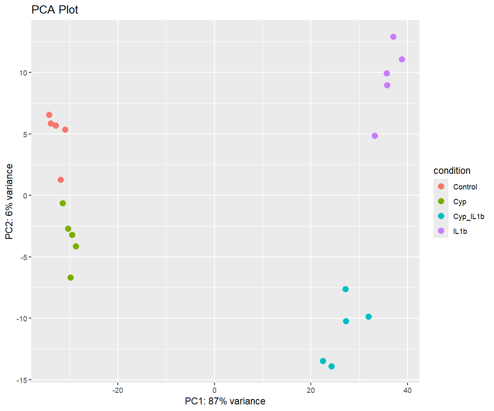

### Sample Distance Heatmap
- Euclidean distance matrix between samples
- Hierarchical clustering to identify sample relationships
- Helps detect outliers and verify replicate consistency

```r
plotDists <- function(vsd.obj) {
  sampleDists <- dist(t(assay(vsd.obj)))
  sampleDistMatrix <- as.matrix(sampleDists)
  
  rownames(sampleDistMatrix) <- colnames(vsd.obj)
  colnames(sampleDistMatrix) <- colnames(vsd.obj)
  
  colors <- colorRampPalette(rev(brewer.pal(9, "Blues")))(255)
  
  pheatmap(sampleDistMatrix,
           clustering_distance_rows = sampleDists,
           clustering_distance_cols = sampleDists,
           col = colors,
           main = "Sample-to-Sample Distance Heatmap")
}

png("DESeq/Plots/Distance_Heatmap.png", width = 1200, height = 1000, res = 150)
plotDists(vsd)
dev.off()

```
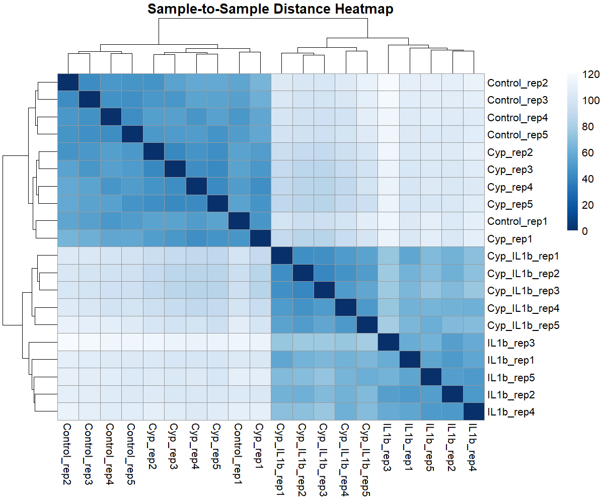

### Variable Gene Heatmap
- Displays top 40 most variable genes across all samples
- Row-centered expression values (z-scores)
- Genes annotated with HUGO symbols
- Samples annotated by condition

```r

variable_gene_heatmap <- function(vsd.obj,
                                  num_genes = 500,
                                  title = "Top Variable Genes Heatmap") {
  
  # Color palette
  ramp <- colorRampPalette(brewer.pal(11, "RdBu"))
  colors <- ramp(256)[256:1]
  
  # Extract VST counts
  mat <- assay(vsd.obj)
  
  # Compute row variances (genes)
  rv <- rowVars(mat)
  
  # Select top variable genes
  top_mat <- mat[order(rv, decreasing = TRUE)[1:num_genes], ]
  
  # Center genes (row-wise)
  top_mat <- top_mat - rowMeans(top_mat)
  
  # Map Ensembl IDs to gene symbols
  gene_symbols <- mapIds(
    org.Hs.eg.db,
    keys = rownames(top_mat),
    column = "SYMBOL",
    keytype = "ENSEMBL",
    multiVals = "first"
  )
  
  # Replace rownames (keep Ensembl if symbol is NA)
  rownames(top_mat) <- ifelse(
    is.na(gene_symbols),
    rownames(top_mat),
    gene_symbols
  )
  
  # Column annotation (condition only)
  annotation_col <- data.frame(
    condition = colData(vsd.obj)$condition
  )
  rownames(annotation_col) <- colnames(top_mat)
  
  # Plot heatmap
  pheatmap(
    top_mat,
    color = colors,
    annotation_col = annotation_col,
    fontsize_col = 8,
    fontsize_row = 250 / num_genes,
    border_color = NA,
    main = title
  )
}

png("DESeq/Plots/variable_gene_Heatmap.png", width = 1200, height = 1000, res = 150)
variable_gene_heatmap(vsd, num_genes = 40,
                      title = "Top 40 Variable Genes")
dev.off()

```
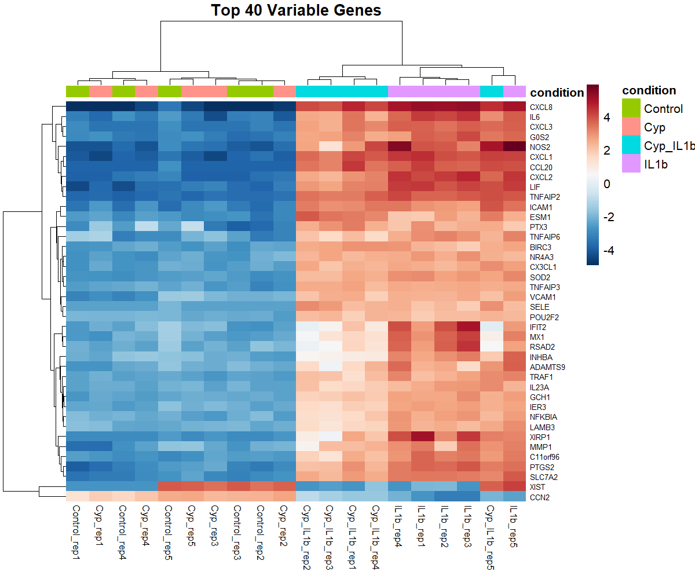

### 14.5 Visualization of Differential Expression Results

### Volcano Plots
- X-axis: log2 fold change
- Y-axis: -log10 adjusted p-value
- Significance thresholds: padj < 0.05 and |log2FC| ≥ 1
- Labeling: Top 10 significant genes labeled with gene symbols

```r

volcano_plot_gg <- function(csv_file, title_text, label_n = 10) {
  
  # Read CSV
  df <- read.csv(csv_file, stringsAsFactors = FALSE)
  
  # Basic filtering and transformation
  df <- df %>%
    filter(!is.na(padj)) %>%
    mutate(
      sig = ifelse(padj < 0.05 & abs(log2FoldChange) >= 1,
                   "Significant", "Not significant"),
      neg_log10_padj = -log10(padj)
    )
  
  # Genes to label (top by padj)
  label_df <- df %>%
    filter(sig == "Significant") %>%
    arrange(padj) %>%
    head(label_n)
  
  ggplot(df, aes(x = log2FoldChange, y = neg_log10_padj)) +
    geom_point(aes(color = sig), alpha = 0.6, size = 1) +
    scale_color_manual(values = c("Not significant" = "blue",
                                  "Significant" = "red")) +
    geom_vline(xintercept = c(-1, 1),
               linetype = "dashed", linewidth = 0.5) +
    geom_hline(yintercept = -log10(0.05),
               linetype = "dashed", linewidth = 0.5) +
    geom_text_repel(
      data = label_df,
      aes(label = gene),
      size = 3,
      max.overlaps = Inf
    ) +
    labs(
      title = title_text,
      x = "log2 Fold Change",
      y = "-log10 adjusted p-value"
    ) +
    theme_minimal() +
    theme(
      legend.title = element_blank(),
      plot.title = element_text(hjust = 0.5)
    )
}

# IL1b vs Control
png("DESeq/Plots/Volcano_plot_IL1b_vs_Control.png", width = 1200, height = 1000, res = 150)
volcano_plot_gg(
  "DESeq/CSV_Files/IL1b_vs_Control/IL1b_vs_Control_all_genes.csv",
  "Volcano Plot: IL1b vs Control"
)
dev.off()

# Cyp_IL1b vs IL1b
png("DESeq/Plots/Volcano_plot_Cyp_IL1b_vs_IL1b.png", width = 1200, height = 1000, res = 150)
volcano_plot_gg(
  "DESeq/CSV_Files/Cyp_IL1b_vs_IL1b/Cyp_IL1b_vs_IL1b_all_genes.csv",
  "Volcano Plot: Cyp_IL1b vs IL1b"
)
dev.off()

```
<table>
  <tr>
    <td align="center">
      <b>IL1b_vs_Control</b><br>
      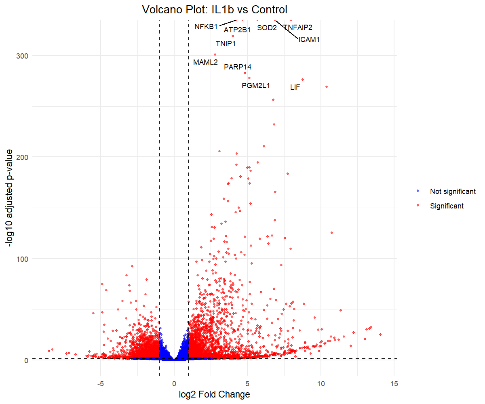
    </td>
    <td align="center">
      <b>Cyp_IL1b_vs_IL1b</b><br>
      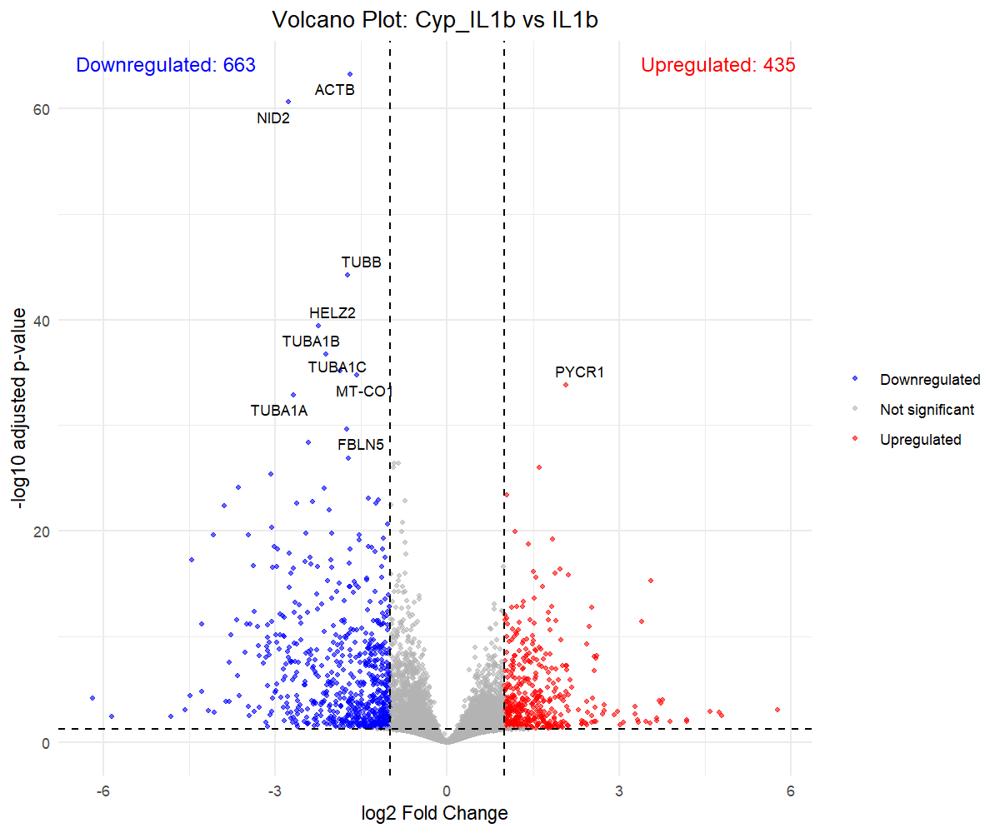
    </td>
  </tr>
</table>


### Log2 Fold Change Comparison Plot
- Compares gene expression changes between two contrasts
- Identifies genes significantly altered in one or both conditions
- Color-coded by significance pattern:
  1. Genes significant only in IL-1β treatment
  2. Genes significant only with cyproheptadine
  3. Genes significant in both comparisons
- Highlights genes showing reversal effects (cyproheptadine counteracting IL-1β)


```r

# Read results files
res1 <- read.csv(
  "DESeq/CSV_Files/IL1b_vs_Control/IL1b_vs_Control_all_genes.csv",
  header = TRUE
)

res2 <- read.csv(
  "DESeq/CSV_Files/Cyp_IL1b_vs_IL1b/Cyp_IL1b_vs_IL1b_all_genes.csv",
  header = TRUE
)

compare_significant_genes <- function(res1, res2, padj_cutoff = 0.0001, 
                                      ngenes = 250, nlabel = 10, 
                                      samplenames = c("comparison1", "comparison2"), 
                                      title = "") {
  # Get list of most upregulated or downregulated genes for each results table
  genes1 <- rbind(head(res1[which(res1$padj < padj_cutoff), ], ngenes), 
                  tail(res1[which(res1$padj < padj_cutoff), ], ngenes))
  genes2 <- rbind(head(res2[which(res2$padj < padj_cutoff), ], ngenes), 
                  tail(res2[which(res2$padj < padj_cutoff), ], ngenes))
  
  # Combine the data from both tables
  de_union <- union(genes1$ensembl_id, genes2$ensembl_id)
  res1_union <- res1[match(de_union, res1$ensembl_id), ][c("ensembl_id", "log2FoldChange", "gene")]
  res2_union <- res2[match(de_union, res2$ensembl_id), ][c("ensembl_id", "log2FoldChange", "gene")]
  combined <- left_join(res1_union, res2_union, by = "ensembl_id", suffix = samplenames)
  
  # Identify overlap between genes in both tables
  combined$de_condition <- NA_character_
  combined$de_condition[which(combined$ensembl_id %in% intersect(genes1$ensembl_id, genes2$ensembl_id))] <- "Significant in Both"
  combined$de_condition[which(combined$ensembl_id %in% setdiff(genes1$ensembl_id, genes2$ensembl_id))] <- paste0("Significant in ", samplenames[1])
  combined$de_condition[which(combined$ensembl_id %in% setdiff(genes2$ensembl_id, genes1$ensembl_id))] <- paste0("Significant in ", samplenames[2])
  
  # Find the top most genes within each condition to label on the graph
  label1 <- rbind(head(combined[which(combined$de_condition == paste0("Significant in ", samplenames[1])), ], nlabel),
                  tail(combined[which(combined$de_condition == paste0("Significant in ", samplenames[1])), ], nlabel))
  label2 <- rbind(head(combined[which(combined$de_condition == paste0("Significant in ", samplenames[2])), ], nlabel),
                  tail(combined[which(combined$de_condition == paste0("Significant in ", samplenames[2])), ], nlabel))
  label3 <- rbind(head(combined[which(combined$de_condition == "Significant in Both"), ], nlabel),
                  tail(combined[which(combined$de_condition == "Significant in Both"), ], nlabel))
  combined_labels <- rbind(label1, label2, label3)
  
  # Plot the genes based on log2FoldChange, color coded by significance
  ggplot(
    combined,
    aes_string(
      x = paste0("`log2FoldChange", samplenames[1], "`"),
      y = paste0("`log2FoldChange", samplenames[2], "`")
    )
  ) +
    geom_point(aes(color = de_condition), size = 0.7) +
    scale_color_manual(values = c("#00BA38", "#619CFF", "#F8766D")) +
    geom_text_repel(
      data = combined_labels,
      aes_string(
        label = paste0("`gene", samplenames[1], "`"),
        color = "de_condition"
      ),
      show.legend = FALSE,
      size = 3
    ) +
    geom_vline(xintercept = 0, size = 0.3, linetype = 2) +
    geom_hline(yintercept = 0, size = 0.3, linetype = 2) +
    labs(
      title = title,
      x = paste0("log2FoldChange in ", samplenames[1]),
      y = paste0("log2FoldChange in ", samplenames[2])
    ) +
    theme_minimal() +
    theme(legend.title = element_blank())
}

png("DESeq/Plots/Log2FoldChange_Comparison_Plot.png", width = 1200, height = 1000, res = 150)
compare_significant_genes(
  res1,
  res2,
  samplenames = c("IL1b_vs_Control", "Cyp_IL1b_vs_IL1b"),
  title = "Gene-level reversal of IL1b effects by Cyp"
)
dev.off()


```
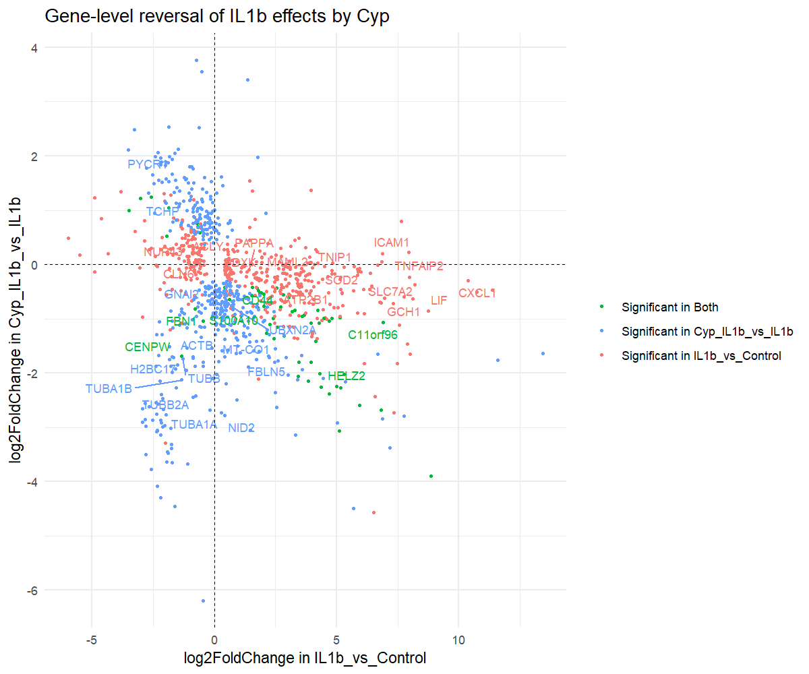

### Differential Expression Heatmaps
- Top 30 genes ranked by absolute log2 fold change
- Row-scaled (z-score) VST-normalized expression
- Hierarchical clustering of genes and samples
- Separate heatmaps for each comparison

```r

DE_gene_heatmap <- function(
    res,
    vsd,
    padj_cutoff = 0.05,
    ngenes = 30,
    title = "Top DE genes",
    condition_order,
    cluster_cols = FALSE
) {
  
  # Select significant genes
  sig_genes <- res %>%
    as.data.frame() %>%
    dplyr::filter(!is.na(padj)) %>%
    dplyr::filter(padj < padj_cutoff) %>%
    dplyr::arrange(desc(abs(log2FoldChange))) %>%
    head(ngenes)
  
  gene_ids <- rownames(sig_genes)
  
  # Extract VST expression
  mat <- assay(vsd)[gene_ids, ]
  
  # Replace Ensembl IDs with symbols
  rownames(mat) <- ifelse(
    is.na(sig_genes$gene),
    gene_ids,
    sig_genes$gene
  )
  
  # Sample annotation
  annotation_col <- data.frame(
    Condition = colData(vsd)$condition
  )
  rownames(annotation_col) <- colnames(mat)
  
  # Enforce comparison-specific order (KEY FIX)
  ord <- order(factor(annotation_col$Condition, levels = condition_order))
  mat <- mat[, ord]
  annotation_col <- annotation_col[ord, , drop = FALSE]
  
  # Color palette
  colors <- colorRampPalette(
    rev(RColorBrewer::brewer.pal(9, "RdBu"))
  )(255)
  
  # Plot heatmap
  pheatmap::pheatmap(
    mat,
    color = colors,
    scale = "row",
    cluster_rows = TRUE,
    cluster_cols = cluster_cols,
    annotation_col = annotation_col,
    fontsize_row = 200 / ngenes,
    fontsize_col = 9,
    border_color = NA,
    main = title
  )
}

png("DESeq/Plots/DE_gene_heatmap_IL1b_vs_Control.png", width = 1200, height = 1000, res = 150)
DE_gene_heatmap(
  res = resLFC1,
  vsd = vsd,
  padj_cutoff = 0.05,
  ngenes = 30,
  title = "Top IL-1β-responsive genes",
  condition_order = c("Cyp", "Control", "IL1b", "Cyp_IL1b"),
  cluster_cols = FALSE
)
dev.off()

png("DESeq/Plots/DE_gene_heatmap_Cyp_IL1b_vs_IL1b.png", width = 1200, height = 1000, res = 150)
DE_gene_heatmap(
  res = resLFC2,
  vsd = vsd,
  padj_cutoff = 0.05,
  ngenes = 30,
  title = "Suppression of IL-1β–induced genes by Cyp",
  condition_order = c("Control", "IL1b", "Cyp_IL1b", "Cyp"),
  cluster_cols = FALSE
)
dev.off()

```
<table>
  <tr>
    <td align="center">
      <b>DE_gene_heatmap_IL1b_vs_Control</b><br>
      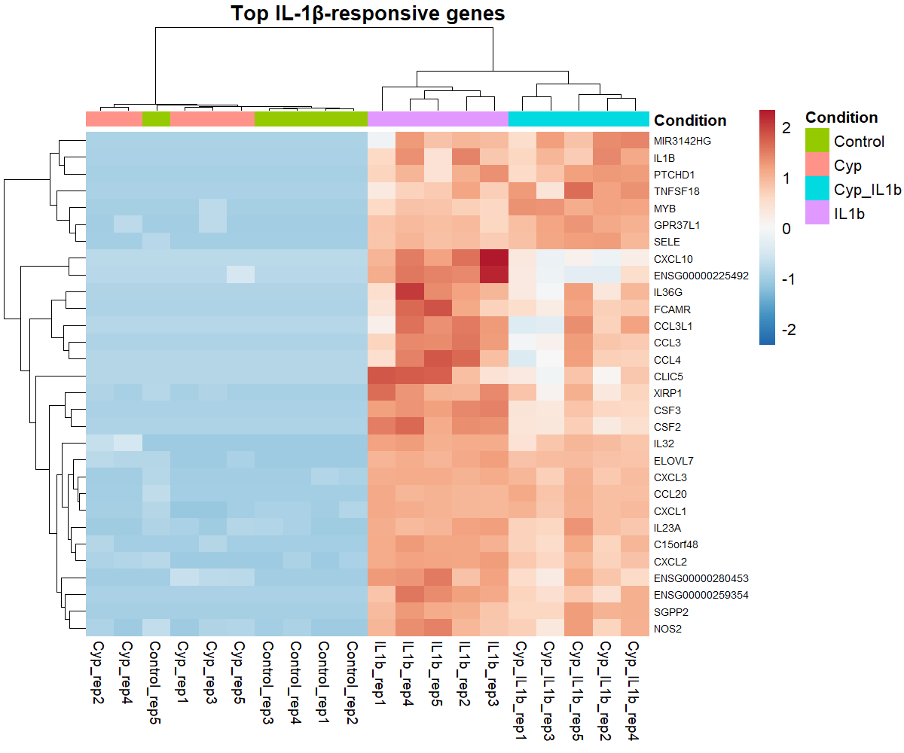
    </td>
    <td align="center">
      <b>DE_gene_heatmap_Cyp_IL1b_vs_IL1b</b><br>
      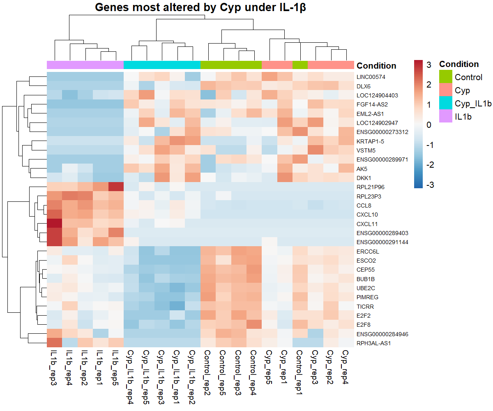
    </td>
  </tr>
</table>

### 14.6 Gene Set Enrichment Analysis (GSEA)

### Load Hallmark Gene Sets

```r

# Load MSigDB Hallmark gene sets
hallmark_sets <- msigdbr(species = "Homo sapiens", category = "H")
hallmark_list <- split(hallmark_sets$gene_symbol,
                       hallmark_sets$gs_name)

```

### Prepare Ranked Gene Lists
- Genes ranked by Wald test statistic
- Duplicates and NAs removed
- Sorted in descending order

```r

# IL1b vs Control
rank1 <- read.table(
  "DESeq/CSV_Files/IL1b_vs_Control/IL1b_vs_Control_rank.rnk",
  header = TRUE, sep = "\t", stringsAsFactors = FALSE)

gene_list_IL1b <- rank1$stat
names(gene_list_IL1b) <- rank1$gene

# Remove NA and duplicates
gene_list_IL1b <- gene_list_IL1b[!is.na(names(gene_list_IL1b))]
gene_list_IL1b <- gene_list_IL1b[!duplicated(names(gene_list_IL1b))]
gene_list_IL1b <- sort(gene_list_IL1b, decreasing = TRUE)

# Cyp_IL1b vs IL1b
rank2 <- read.table(
  "DESeq/CSV_Files/Cyp_IL1b_vs_IL1b/Cyp_IL1b_vs_IL1b_rank.rnk",
  header = TRUE, sep = "\t", stringsAsFactors = FALSE)

gene_list_Cyp <- rank2$stat
names(gene_list_Cyp) <- rank2$gene

gene_list_Cyp <- gene_list_Cyp[!is.na(names(gene_list_Cyp))]
gene_list_Cyp <- gene_list_Cyp[!duplicated(names(gene_list_Cyp))]
gene_list_Cyp <- sort(gene_list_Cyp, decreasing = TRUE)

```

### Run fgsea

```r

fgsea_IL1b <- fgsea(
  pathways = hallmark_list,
  stats = gene_list_IL1b,
  minSize = 15,
  maxSize = 500,
  nperm = 10000
)

fgsea_Cyp <- fgsea(
  pathways = hallmark_list,
  stats = gene_list_Cyp,
  minSize = 15,
  maxSize = 500,
  nperm = 10000
)

```

### Compare GSEA Results Across Conditions

```r

# Merge GSEA results from both comparisons
compare_hallmark <- fgsea_IL1b %>%
  dplyr::select(pathway, NES_IL1b = NES, padj_IL1b = padj) %>%
  dplyr::left_join(
    fgsea_Cyp %>%
      dplyr::select(pathway, NES_Cyp = NES, padj_Cyp = padj),
    by = "pathway"
  )

# Filter for pathways of interest
compare_hallmark %>%
  filter(grepl("INFLAMMATORY|IL6|TNFA|CYTOKINE|AUTOPHAGY", pathway))

```

### Pathway Analysis Visualizations
1. Enrichment Plots
- Running enrichment score for specific pathways
- Example: HALLMARK_INFLAMMATORY_RESPONSE
- Generated for both comparisons

```r

png("DESeq/Plots/HALLMARK_INFLAMMATORY_RESPONSE_enrichment_IL1b_vs_Control.png", width = 1200, height = 1000, res = 150)
plotEnrichment(
  hallmark_list[["HALLMARK_INFLAMMATORY_RESPONSE"]],
  gene_list_IL1b
) +
  labs(title = "Inflammatory Response – IL1b vs Control")
dev.off()

png("DESeq/Plots/HALLMARK_INFLAMMATORY_RESPONSE_enrichment_Cyp_IL1b_vs_IL1b.png", width = 1200, height = 1000, res = 150)
plotEnrichment(
  hallmark_list[["HALLMARK_INFLAMMATORY_RESPONSE"]],
  gene_list_Cyp
) +
  labs(title = "Inflammatory Response – Cyp_IL1b vs IL1b")
dev.off()

```
<table>
  <tr>
    <td align="center">
      <b>Enrichment_plot_IL1b_vs_Control</b><br>
      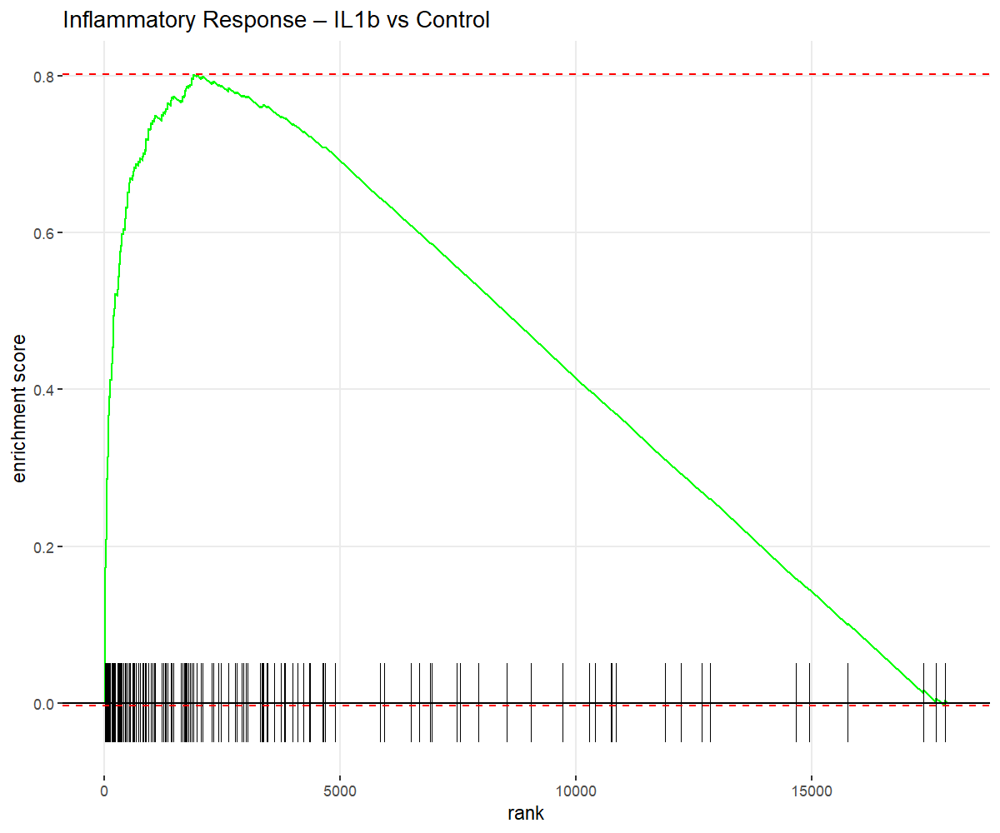
    </td>
    <td align="center">
      <b>Enrichment_plot_Cyp_IL1b_vs_IL1b</b><br>
      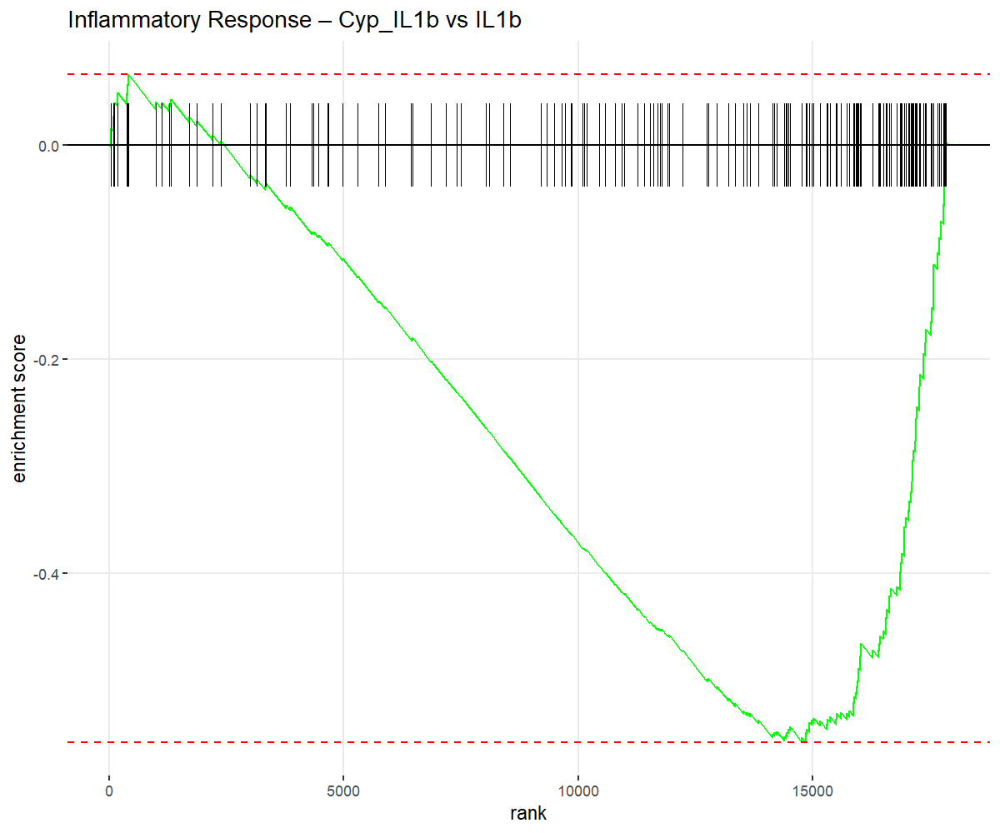
    </td>
  </tr>
</table>

2. Waterfall Plots
- Normalized Enrichment Score (NES) for all significant pathways (padj < 0.05)
- Pathways sorted by NES
- Color-coded: Orange (activated/upregulated), Blue (suppressed/downregulated)

```r

waterfall_plot <- function(fgsea_results, graph_title) {
  
  fgsea_results %>%
    filter(padj < 0.05) %>%
    arrange(desc(NES)) %>%
    mutate(
      short_name = str_replace(pathway, "HALLMARK_", "")
    ) %>%
    ggplot(aes(x = reorder(short_name, NES), y = NES)) +
    geom_col(aes(fill = NES > 0)) +
    coord_flip() +
    scale_fill_manual(
      values = c("TRUE" = "#D55E00", "FALSE" = "#0072B2"),
      labels = c("Activated", "Suppressed")
    ) +
    labs(
      title = graph_title,
      x = "Hallmark Pathway",
      y = "Normalized Enrichment Score (NES)"
    ) +
    theme_minimal(base_size = 12) +
    theme(
      legend.title = element_blank(),
      axis.text.y = element_text(size = 9),
      plot.title = element_text(hjust = 0.5)
    )
}

png("DESeq/Plots/Waterfall_plot_IL1b_vs_Control.png", width = 1200, height = 1000, res = 150)
waterfall_plot(
  fgsea_IL1b,
  "Hallmark pathways altered by IL1b treatment"
)
dev.off()

png("DESeq/Plots/Waterfall_plot_Cyp_IL1b_vs_IL1b.png", width = 1200, height = 1000, res = 150)
waterfall_plot(
  fgsea_Cyp,
  "Hallmark pathways altered by Cyproheptadine under IL1b"
)
dev.off()

```
<table>
  <tr>
    <td align="center">
      <b>Waterfall_plot_IL1b_vs_Control</b><br>
      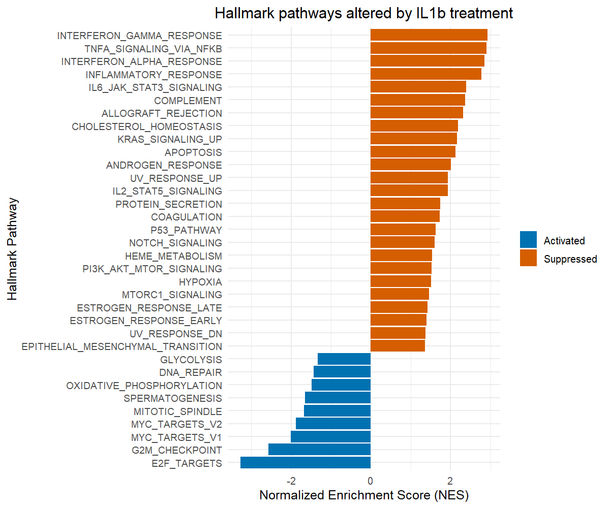
    </td>
    <td align="center">
      <b>Waterfall_plot_Cyp_IL1b_vs_IL1b</b><br>
      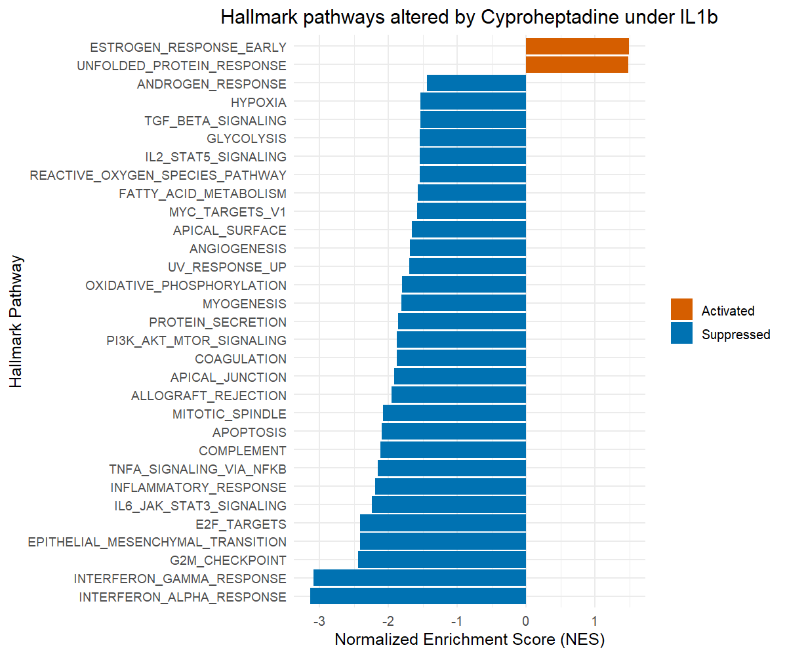
    </td>
  </tr>
</table>

### 14.7 Key Outputs Generated
CSV files and plots produced by the workflow (examples):
- IL1b_vs_Control_all_genes.csv
- IL1b_vs_Control_sig_genes.csv
- IL1b_vs_Control_top40_genes.csv
- IL1b_vs_Control_rank.rnk
- Corresponding files for Cyp_IL1b_vs_IL1b
- PCA plot, sample distance heatmap, variable gene heatmap, volcano plots, log2FC comparison scatter plot, DE gene heatmaps, GSEA enrichment plots, waterfall plots.

### 14.8 Biological Interpretation
- IL-1β effects: activates inflammatory response programs and identifies genes associated with cartilage degradation and inflammation.
- Cyproheptadine effects: reveals how Cyp modulates gene expression in inflamed cells and identifies potential pathways where it may counteract IL-1β effects.
- Clinical relevance: provides candidate genes and pathways for follow-up validation to explore cyproheptadine as a potential therapeutic strategy in osteoarthritis.
---
---

### 📚 Acknowledgments
*
This workflow is based on the RNA-Seq analysis tutorial by Eric Lu: [bulk-rnaseq-analysis](https://github.com/erilu/bulk-rnaseq-analysis). 
The pipeline was modified for this cyproheptadine study.
---

> *Click on any step in [Quick Navigation](#quick-navigation) to jump directly to that section!*
